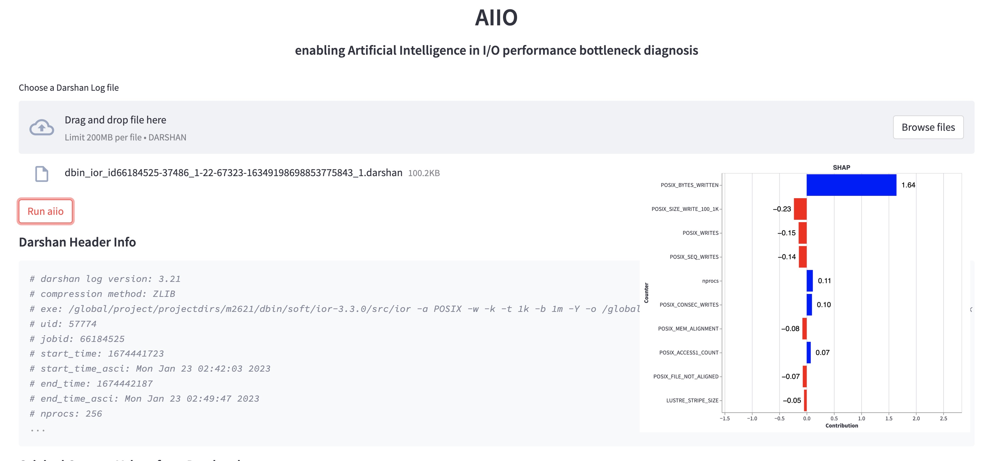

# AIIO

The AIIO Web Service is accessible via :
http://aiio.bindong.development.svc.spin.nersc.org/

(Under the resource constraint now, the web may be very slow)

This repo contains the materials for our paper.

Bin Dong, Jean Luca Bez, and Suren Byna. 2023. AIIO: Using Artificial Intelligence for Job-Level and Automatic I/O Performance Bottleneck Diagnosis. In Proceedings of the 32nd International Symposium on High-Performance Parallel and Distributed Computing (HPDC ’23), June 16–23, 2023, Orlando, FL, USA. ACM, New York, NY, USA, 13 pages. https://doi.org/10.1145/3588195.3592986

Please grab a Darshan log from darshan-logs-for-paper and try the AIIO Web Service 

Disclaimer:
1) Our models are trained with Darshan logs from Cori Supercomputer of NERSC.

2) To use your own Darshan, you must run your application with Lustre file system because our models are trained with Luster counters. 

3) Follow the Darshan documentation to get Darshan logs.
   https://www.mcs.anl.gov/research/projects/darshan/

Please contain Bin Dong,  dbin@lbl.gov for the questions.

The code has source code under a modified BSD license. The license is a BSD license with an ADDED paragraph at the end that makes it accept improvements without a hassle. 
See below for detailed information

***************************

*** Copyright Notice ***

AIIO Copyright (c) 2023, The Regents of the University of California,
through Lawrence Berkeley National Laboratory (subject to receipt of
any required approvals from the U.S. Dept. of Energy) and Ohio State
University. All rights reserved.

If you have questions about your rights to use or distribute this software,
please contact Berkeley Lab's Intellectual Property Office at
IPO@lbl.gov.

NOTICE.  This Software was developed under funding from the U.S. Department
of Energy and the U.S. Government consequently retains certain rights.  As
such, the U.S. Government has been granted for itself and others acting on
its behalf a paid-up, nonexclusive, irrevocable, worldwide license in the
Software to reproduce, distribute copies to the public, prepare derivative 
works, and perform publicly and display publicly, and to permit others to do so.

****************************

*** License Agreement ***

AIIO Copyright (c) 2023, The Regents of the University of California,
through Lawrence Berkeley National Laboratory (subject to receipt of
any required approvals from the U.S. Dept. of Energy) and Ohio State
University. All rights reserved.

Redistribution and use in source and binary forms, with or without
modification, are permitted provided that the following conditions are met:

(1) Redistributions of source code must retain the above copyright notice,
this list of conditions and the following disclaimer.

(2) Redistributions in binary form must reproduce the above copyright
notice, this list of conditions and the following disclaimer in the
documentation and/or other materials provided with the distribution.

(3) Neither the name of the University of California, Lawrence Berkeley
National Laboratory, U.S. Dept. of Energy, Ohio State University, nor the
names of its contributors may be used to endorse or promote products
derived from this software without specific prior written permission.

THIS SOFTWARE IS PROVIDED BY THE COPYRIGHT HOLDERS AND CONTRIBUTORS "AS IS" AND ANY EXPRESS OR IMPLIED WARRANTIES, INCLUDING, BUT NOT LIMITED TO, THE IMPLIED WARRANTIES OF MERCHANTABILITY AND FITNESS FOR A PARTICULAR PURPOSE
ARE DISCLAIMED. IN NO EVENT SHALL THE COPYRIGHT OWNER OR CONTRIBUTORS BE LIABLE FOR ANY DIRECT, INDIRECT, INCIDENTAL, SPECIAL, EXEMPLARY, OR CONSEQUENTIAL DAMAGES (INCLUDING, BUT NOT LIMITED TO, PROCUREMENT OF SUBSTITUTE GOODS OR SERVICES; LOSS OF USE, DATA, OR PROFITS; OR BUSINESS INTERRUPTION) HOWEVER CAUSED AND ON ANY THEORY OF LIABILITY, WHETHER IN
CONTRACT, STRICT LIABILITY, OR TORT (INCLUDING NEGLIGENCE OR OTHERWISE) ARISING IN ANY WAY OUT OF THE USE OF THIS SOFTWARE, EVEN IF ADVISED OF THE POSSIBILITY OF SUCH DAMAGE.

You are under no obligation whatsoever to provide any bug fixes, patches,
or upgrades to the features, functionality or performance of the source
code ("Enhancements") to anyone; however, if you choose to make your
Enhancements available either publicly, or directly to Lawrence Berkeley
National Laboratory, without imposing a separate written license agreement
for such Enhancements, then you hereby grant the following license: a
non-exclusive, royalty-free perpetual license to install, use, modify,
prepare derivative works, incorporate into other computer software,
distribute, and sublicense such enhancements or derivative works thereof,
in binary and source code form.

